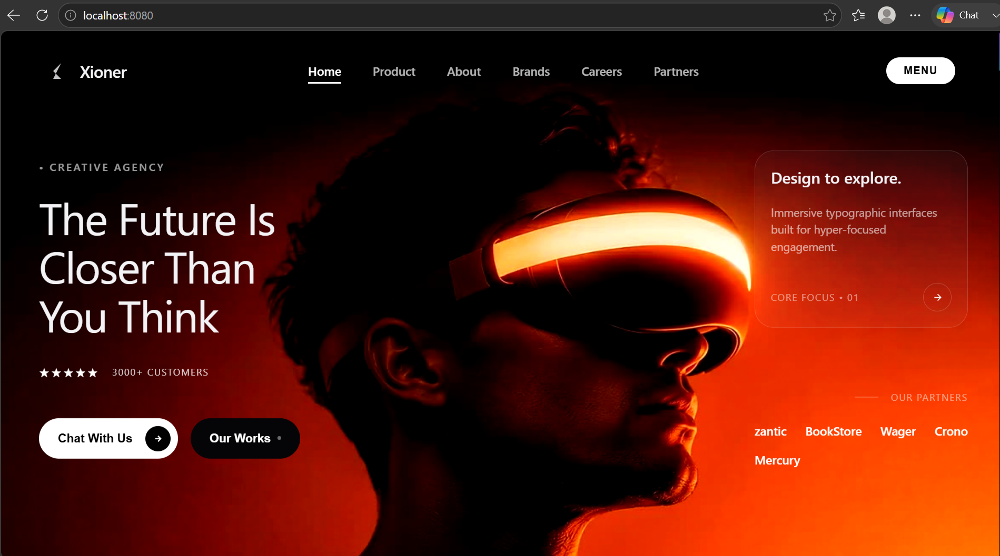
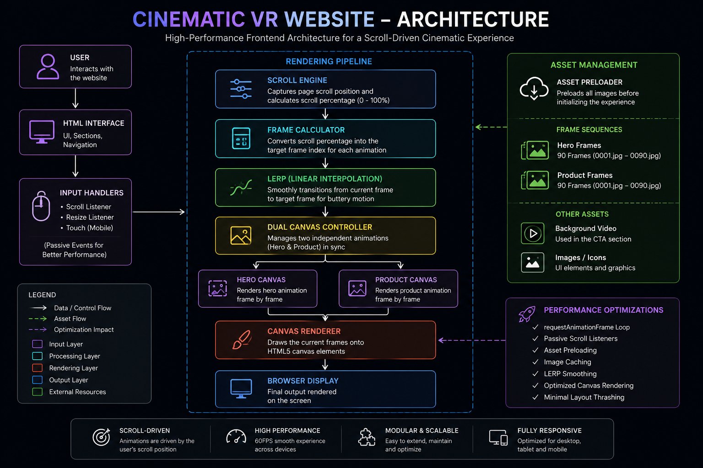

# Cinematic VR Website

An Apple-inspired cinematic VR landing page built entirely with **HTML5, CSS3, and Vanilla JavaScript**, featuring scroll-driven frame animations, dual HTML5 canvas rendering, custom asset preloading, buttery-smooth interpolation (LERP), and high-performance rendering techniques.

Unlike traditional WebGL implementations, this project achieves a premium 3D visual experience using pre-rendered frame sequences, resulting in exceptional performance across desktop and mobile devices.

---

## Live Demo

**Website:** *(Add your deployed URL here)*

## Table of Contents

- [Overview](#overview)
- [Screenshots](#screenshots)
- [Architecture](#architecture)
- [Project Structure](#project-structure)
- [Tech Stack](#tech-stack)
- [Core Features](#core-features)
- [Performance Optimizations](#performance-optimizations)
- [Animation Pipeline](#animation-pipeline)
- [Engineering Challenges](#engineering-challenges)
- [Lessons Learned](#lessons-learned)
- [Future Improvements](#future-improvements)
- [Contact](#contact)

## Overview

This project recreates the premium storytelling experience commonly found on Apple's product pages by combining scroll-driven animations, cinematic transitions, and responsive layouts into a lightweight web application.

Instead of rendering complex 3D models in real time, the application displays carefully pre-rendered image sequences synchronized with the user's scroll position. This approach delivers a high-end visual experience while maintaining excellent performance and browser compatibility.

The project was built completely from scratch without animation libraries or frontend frameworks, focusing on performance engineering, smooth user interactions, and clean architecture.

## Screenshots

### Dashboard

## Architecture

### System Architecture

The application follows a lightweight client-side architecture where user interactions drive synchronized canvas rendering, animation timing, and asset management entirely within the browser.

Key architectural principles include:

- Dual HTML5 Canvas rendering pipeline
- Scroll-driven animation engine
- Asset preloading before initialization
- requestAnimationFrame rendering loop
- Linear interpolation (LERP) for smooth transitions
- Responsive layout with sticky scrolling sections

